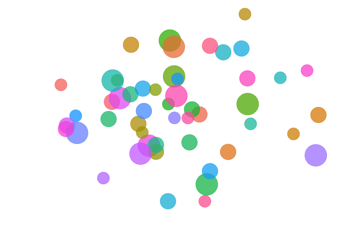
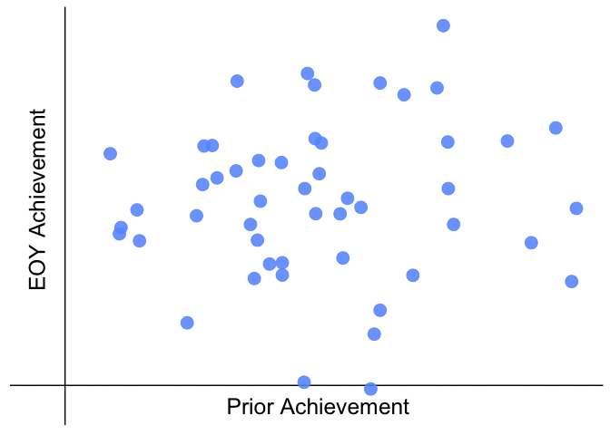
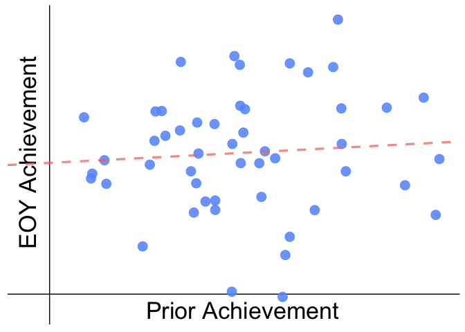
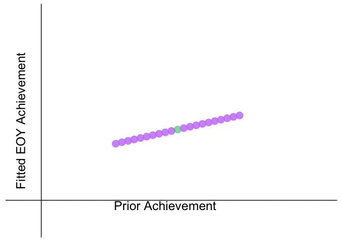

SGPanimation
================

Purpose
-------

Purpose of this book is to develop an animation that takes advantage of **gganimate**, **tweenr**, and other R packages. The animation will hopefully provide an intuitive animation for how student growth percentiles are calculated using an approach *similar* to the NYC Department of Education.

**Disclaimer**: I contributed to this book in my own personal capacity. The views and content expressed here are my own and do not necessarily represent the views of the NYC Department of Education.

Student Growth
--------------

The NYC Department of Education (NYCDOE) calculates a student's growth over the course of an academic year by calculating a student growth percentile -- or an SGP. An SGP is a simple calculation where a student's achievement at the end of a year is compared to the achievement of other 'similar' students. Typically, similar students -- commonly refered to as *peer* students -- are defined as students that start the school year with similar prior achievement scores. The NYCDOE defines peer students differently. Instead of defining peer students based only on their prior achievement scores at the start of the school year, the NYCDOE also takes demographic characteristics into consideration (e.g. English language learner status, economic disadvantage).

To identify groups of similar students based on all these characteristics, the NYCDOE runs a **regression**. That's just a fancy of saying that they use all the prior achievement scores and demographic data they have to estimate what they think a student should score at the end of the year.

Let's walkthrough a series of animations to get a better picture of what that looks like.

Students of All Backgrounds
---------------------------

*Under Construction - Explanation pending*

Plot Students by Prior Achievement
----------------------------------

*Under Construction - Explanation pending*

Fit a Regression Line
---------------------

*Under Construction - Explanation pending*

Estimate Fitted EOY Achievement
-------------------------------

*Under Construction - Explanation pending*

Assign peer groups for each student
-----------------------------------

*Under Construction - Explanation pending*

Assign Student Growth Percentile
--------------------------------

*Under Construction - Explanation pending*

