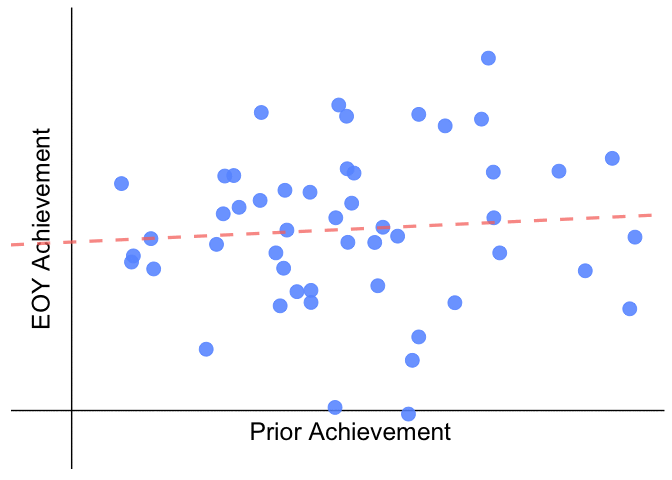

SGPanimation
================

Purpose
-------

Purpose of this book is to develop an animation that takes advantage of **gganimate**, **tweenr**, and other R packages. The animation will hopefully provide an intuitive animation for how student growth percentiles are created in the NYC Department of Education.

Load Packages
-------------

Students of All Backgrounds
---------------------------

*Under Construction - Explanation pending* 

Plot Students by Prior Achievement
----------------------------------

*Under Construction - Explanation pending*

Fit a Regression Line
---------------------

*Under Construction - Explanation pending*

Estimate Fitted EOY Achievement
-------------------------------

*Under Construction - Explanation pending*

Assign peer groups for each student
-----------------------------------

*Under Construction - Explanation pending*

Assign Student Growth Percentile
--------------------------------

*Under Construction - Explanation pending*

